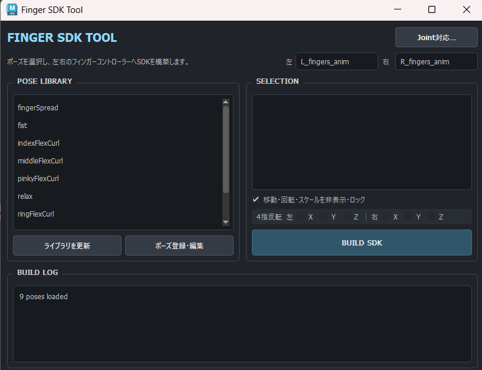
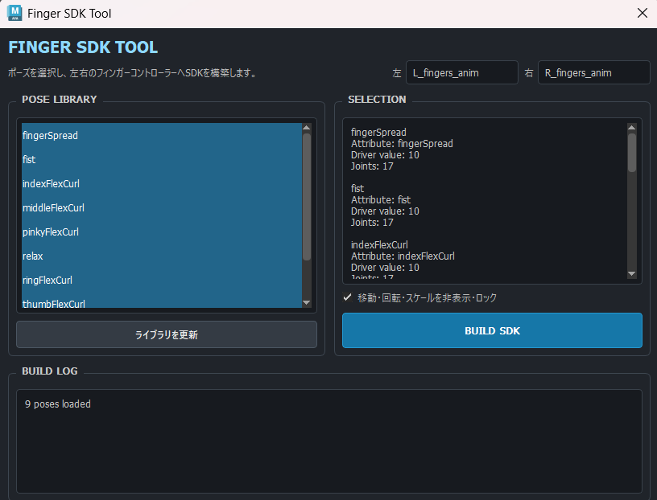
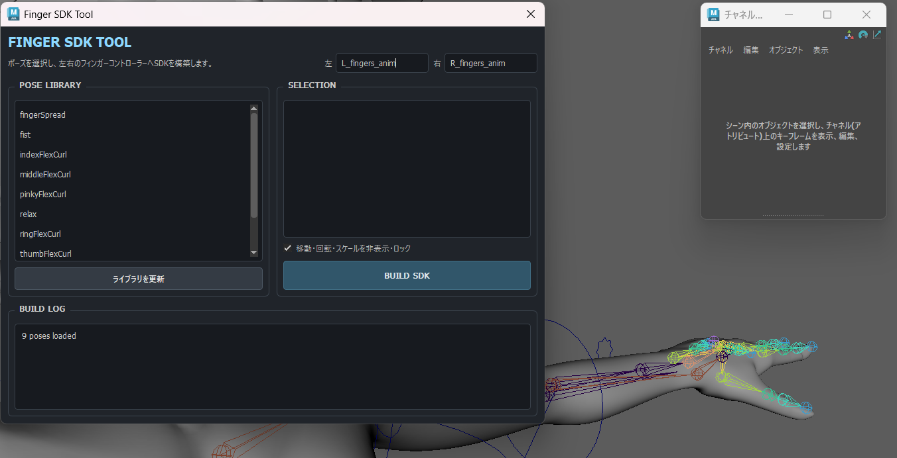
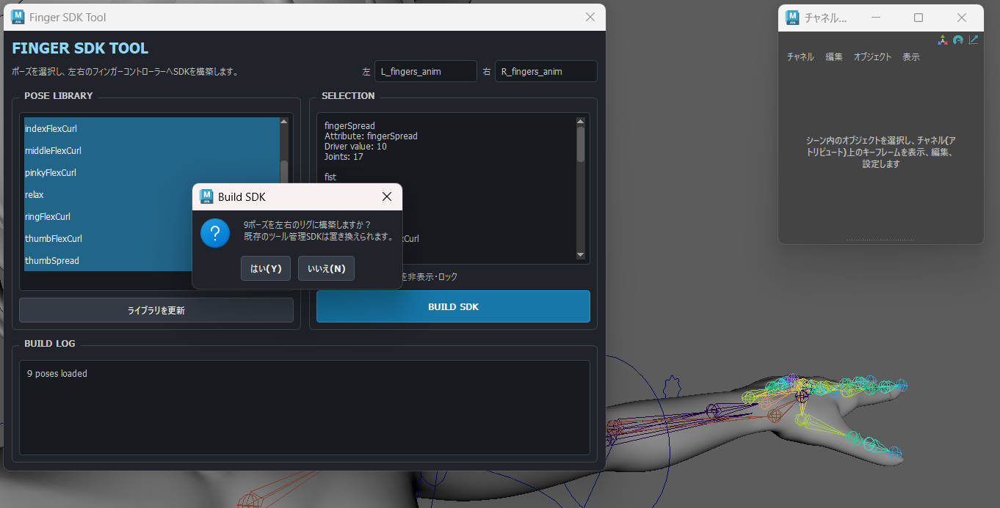
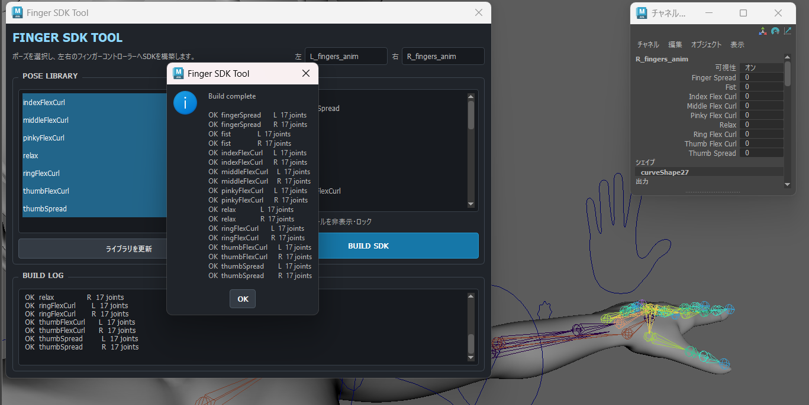
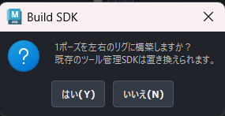

# Finger SDK Tool   



Autodesk Maya向けの、**JSONベースのPose DataからFinger SDK（Set Driven Key）を自動構築するリギングツール**です。

複数の指Jointに対して繰り返し行うSDK設定を自動化するとともに、**キャラクター固有のPose DataとSDK構築処理を分離**することで、ポーズの追加・調整・再構築を行いやすくしています。

単に作業時間を短縮するだけではなく、**保守性・拡張性・共同制作での扱いやすさ**を重視して設計しました。

---

## Features

* **JSON-based Pose Library**
  指ポーズをJSONとして管理し、Pythonコードを変更せずにポーズの追加・調整ができます。

* **Automatic SDK Build**
  選択したPose DataからDriver AttributeとDriven Keyを自動構築します。

* **Multi-pose Build**
  必要なポーズを複数選択し、一度にまとめてSDKを構築できます。

* **Left / Right Resolution**
  左右で共通のPose Dataを利用し、`L_` / `R_` をツール側で解決します。

* **Idempotent Rebuild**
  同じPoseを再BuildしてもSDK Curveが重複しないよう、Build対象に関連する既存SDKを整理して再構築します。

* **Validation / Rollback**
  Build前にPose DataやControllerなどの主要項目を検証し、処理中にエラーが発生した場合はMayaのUndoを利用して可能な範囲でRollbackを行います。

* **Maintainable Architecture**
  UI / Data Processing / Maya Scene Operationsを分離し、機能追加や修正の影響範囲を抑えています。

* **Team-friendly Data Management**
  Pose DataをJSONとして独立管理することで、Pythonコードを直接編集しなくてもポーズ調整やデータ共有を行えます。

---

## Overview

Finger SDKを手作業で構築する場合、複数の指Jointに対して多数のDriven Keyを設定する必要があります。

キャラクターやポーズが増えるほど、

* 同じSDK設定作業を何度も繰り返す
* 左右で設定差が発生する
* JointやChannelの指定ミスが起こる
* ポーズ修正のたびにSDK Curveを編集する
* キャラクター固有の数値がPythonコードへ入り込む

といった問題が発生しやすくなります。

Finger SDK Toolでは、

**Pose DataとBuild Logicを分離する**

ことを中心に設計しています。

```text
Pose Data
   JSON
    │
    ▼
Validation
    │
    ▼
Name Resolution
    │
    ▼
Reusable Build Logic
    │
    ▼
Maya SDK Network
```

ポーズ値はJSON、Validationや名前解決はCore、実際のMaya Scene操作はBuilderが担当します。

これにより、SDKの構築ロジックを維持したまま、**Pose Dataだけを追加・変更して異なるポーズへ展開できる構造**にしています。

---

## Main Functions

### JSON-based Pose Library



Finger PoseをPythonコードへ直接記述せず、JSONファイルとして管理します。

```json
{
  "pose_name": "fist",
  "driver_attr": "fist",
  "driver_value": 10,
  "joints": {
    "index1_jnt": {
      "rotateX": 0,
      "rotateY": 0,
      "rotateZ": -75
    }
  }
}
```

Pose DataとBuild Logicを分離しているため、ポーズ値を変更するときにSDK構築処理そのものを編集する必要がありません。

これにより、**リガーだけでなくPose Dataを調整するメンバーも、処理ロジックへ触れずにデータを編集・共有できる構造**を目指しています。

### Automatic SDK Build







UIから使用したいPoseを選択し、`BUILD SDK`を実行すると、JSONの定義をもとにFinger SDK Networkを構築します。

```text
Driver Controller
      │
      ▼
Driver Attribute
      │
      ▼
SDK Curve
      │
      ▼
Finger Joint
```

大量のDriven Keyを手作業で設定する必要がなく、同じルールで一貫したSDKを構築できます。

### Multi-pose Build

Ctrl / Shiftによる複数選択に対応しています。Fist / Relax / Spread / Flex Curlなど、必要なPoseをまとめて選択して一度にBuildできます。

UI上では、Driver Attribute、Driver Value、Pose Definitionに含まれるJoint Countを確認してから処理を実行できます。

### Left / Right Resolution

JSONではJoint名から左右のPrefixを省略できます。

```text
index1_jnt
```

という定義を、

```text
L_index1_jnt
R_index1_jnt
```

としてツール側で解決します。

左右でほぼ同じPose Definitionを二重に管理する必要がないため、データ量を減らすだけでなく、**片側だけ修正されて左右差が発生するリスクを抑えます。**

### Idempotent Rebuild



Pose Dataを調整したあとも、同じBuild操作でSDKを更新できます。

```text
Existing SDK
     │
     ▼
Target SDK Cleanup
     │
     ▼
Rebuild
     │
     ▼
Updated SDK
```

Rebuild時には、今回BuildするPoseのDriver Attributeに関連する既存SDKを整理してから再構築します。

これにより、他のユーザー定義Attributeや無関係なSDKへ影響する範囲を限定しながら、同じPoseを繰り返しBuildした際のSDK Curve重複を防ぎます。

「最初に一度だけ実行するツール」ではなく、**制作中の調整 → 確認 → 修正 → 再構築を繰り返せること**を重視しています。

---

## Workflow

1. 対象Character RigをMayaで開く
2. Finger SDK Toolを起動
3. Libraryから必要なPoseを選択
4. Driver Attribute / Value / Pose Definition Joint Countを確認
5. `BUILD SDK`を実行
6. Finger Controller / SDK Networkを自動構築
7. Maya上で動作を確認
8. 必要に応じてJSONを調整してRebuild

```text
Select Pose
    ↓
Validate
    ↓
Build
    ↓
Check
    ↓
Edit JSON
    ↓
Rebuild
```

Pose調整とSDK再構築を短いサイクルで繰り返せるワークフローにしています。

---

## Design

### Data-driven Design

このツールで最も重視しているのが、**Pose DataとBuild Logicを分離すること**です。

```text
Pose Data     → JSON
Validation    → core.py
Maya Build    → builder.py
UI            → main.py
```

キャラクター固有の数値をPythonコードへ直接埋め込まないことで、ツール本体を安定させながらデータ側を拡張できます。

### Maintainability

UI、Data Validation、Name Resolution、Maya Scene Operations、Pose Dataを責務ごとに分離しています。

JSON Schemaの変更であればCore、SDK構築方法の変更であればBuilderというように、**変更対象と影響範囲を把握しやすい構造**を意識しています。

### Extensibility

```text
New Pose
   ↓
Add JSON
   ↓
Validation
   ↓
Existing Builder
   ↓
Build
```

新しいPoseを追加するたびにPython側へ専用処理を追加する構造を避け、Pose Libraryを段階的に拡張できます。

### Collaboration

```text
Programmer / TA
        │
        └── Build Logic

Rigger / Artist
        │
        └── Pose Data
```

Pose調整のためにSDK Builder本体へ直接変更を加える必要がなく、Git上でも**「ロジックの変更」と「Pose Dataの変更」を分けてレビューしやすい**構成です。

JSONはテキスト形式のため差分確認もしやすく、Pose DataをVersion Control下で共有・管理できます。

### Safe Iteration

制作中の **調整 → 確認 → 修正 → 再構築** を支えるため、主要項目のPre-build Validation、既存SDKのCleanup、Single Undo、Maya Undoを利用したRollbackを組み合わせています。

Pose Dataの修正後も同じBuild Workflowを繰り返せるようにすることで、試行錯誤しやすく、問題が発生した場合にも操作を戻しやすい構成を意識しています。

---

## Architecture

UI、データ処理、Maya Scene操作を分離しています。

```text
                 Finger SDK Tool
                        │
          ┌─────────────┴─────────────┐
          │                           │
     Pose Templates                  UI
        JSON                      main.py
          │                           │
          └─────────────┬─────────────┘
                        ▼
                     core.py
              Validation / Resolution
                        │
                        ▼
                    builder.py
              Maya Scene Operations
                SDK Construction
                        │
                        ▼
                    Maya Rig
```

### `main.py`

* PySide UI
* Pose Selection
* Build Confirmation
* Progress表示
* Build Workflow管理

### `core.py`

* JSON Loading
* Pose Validation
* Joint Name Resolution
* Maya非依存のデータ処理

### `builder.py`

* Controller生成
* Driver Attribute生成
* SDK Curve構築
* Existing SDK Cleanup
* Maya Scene操作

### `templates/`

* Version Controlled Pose Data
* Character / Pose固有の設定値

処理を分離することで、Mayaに依存しないロジックを単独でTestできるようにしています。

---

## Validation / Safety

Build開始前に、Pose Data、Controller、Driver Attributeなどの主要項目と、Pose Definitionで使用するFinger Jointを確認します。

一部のFinger JointがScene上に存在しない場合は、不足しているJointをWarningで表示し、存在するJointのみを対象にBuildを続行するか、処理を中止するか選択できます。

対象となるFinger Jointが1つも見つからないPoseまたはSideがある場合は、Buildを開始せずエラーとして処理します。

Build処理はひとつのUndo Chunkとしてまとめています。

処理中にエラーが発生した場合は、MayaのUndoが利用可能で、作成したUndo Chunkを確認できる場合にRollbackを実行します。

これにより通常のMaya環境では途中まで行われたBuild処理を戻せるようにしていますが、Undoが無効になっている特殊な環境では完全な復元を保証するものではありません。

Rebuild時には今回BuildするPoseのDriver Attributeに関連する既存SDK Curveを整理してから再構築することで、同じPoseを繰り返しBuildした際のCurve重複を防いでいます。

---

## Testing

Mayaに依存しないCore Logicを分離し、Pure PythonのUnit Testを実装しています。

```bash
python -m unittest discover -s tests -v
```

Pose JSON Loading、Pose Validation、Joint Name Resolution、Left / Right Resolution、Missing Joint Detection、Build対象外Attributeを保持するCleanup Regressionなどをテストしています。

Mayaとの統合部分については、Controller Generation、Left / Right Build、Multiple Pose Build、SDK Rebuild、Duplicate Prevention、Rollback、Single Undoを実際のScene上で確認します。

### GitHub Actions

```text
Push / Pull Request
        ↓
Python Syntax Check
        ↓
Unit Tests
        ↓
Result
```

Python 3.9 / 3.11 / 3.13でテストを実行し、Maya非依存部分のRegressionを確認します。

---

## Technical Details

* Autodesk Maya 2022–2026
* Python 3
* maya.cmds
* PySide2 / PySide6
* JSON
* unittest
* GitHub Actions

### Technical Focus

* JSONによるData / Logic Separation
* JSON Pose Validation
* Left / Right Joint Name Resolution
* Set Driven Key Network Construction
* Existing SDK Cleanup / Rebuild
* Idempotent Rebuild
* Single Undo / Rollback
* Maya-independent Core Testing

---

## Requirements

* Autodesk Maya 2022–2026
* Python 3
* 対応するFinger Joint Structure
* `L_` / `R_` Prefixを使用するRig

外部Python Packageは必要ありません。

付属Pose TemplateはDiana RigのJoint Namingを基準にしています。

```text
L_index1_jnt
R_pinky3_jnt
L_thumb_palm_jnt
```

使用するRigのJoint名は、`templates/*.json`の定義と対応している必要があります。

---

## Installation

リポジトリをMayaのUser Scripts Directoryへ配置します。

```text
Documents/
└─ maya/
   └─ scripts/
      └─ Finger-SDK-Tool/
```

MayaでShelf Buttonを作成し、CommandのLanguageを **Python** に設定して、以下のコードを貼り付けます。

```python
from pathlib import Path
import importlib.util
import sys

import maya.cmds as cmds


tool_root = Path(cmds.internalVar(userAppDir=True)) / "scripts" / "Finger-SDK-Tool"
main_file = tool_root / "main.py"

if not main_file.is_file():
    cmds.error(
        "Finger SDK Tool was not found:\n{}\n\n"
        "Install the Finger-SDK-Tool folder directly under:\n{}".format(
            main_file, tool_root.parent
        )
    )

module_name = "_finger_sdk_tool_main"
sys.modules.pop(module_name, None)
spec = importlib.util.spec_from_file_location(module_name, str(main_file))
if spec is None or spec.loader is None:
    cmds.error("Could not load: {}".format(main_file))

module = importlib.util.module_from_spec(spec)
sys.modules[module_name] = module
spec.loader.exec_module(module)
module.show()
```

> `maya/2026/ja_JP/scripts` などのVersion / Locale固有Directoryではなく、User Scripts Directoryへの配置を推奨します。

---

## Project Structure

```text
Finger-SDK-Tool/
│
├─ main.py
│  └─ UI / Build Workflow
├─ core.py
│  └─ JSON Validation / Name Resolution
├─ builder.py
│  └─ Maya Scene Operations / SDK Construction
├─ templates/
│  ├─ fist.json
│  ├─ relax.json
│  ├─ fingerSpread.json
│  └─ ...
├─ resources/
│  └─ fingers_anim.ma
├─ tests/
│  ├─ test_core.py
│  └─ test_builder.py
├─ .github/
│  └─ workflows/
│     └─ ci.yml
└─ README.md
```

---

## Current Scope / Limitations

### Supported

* JSON Pose Template
* Multiple Pose Build
* Left / Right Build
* SDK Rebuild
* Duplicate Prevention
* Controller Generation
* Pre-build Core Validation
* Single Undo / Rollback

### Supported Driven Channels

```text
rotateX
rotateY
rotateZ
```

### Current Limitations

* 付属TemplateはDiana RigのNaming / Joint Structureを基準としています
* Joint名はTemplate Definitionと対応している必要があります
* 現在はFinger SDKを対象としており、汎用SDK Builderではありません
* SDK Curveにはツール固有のOwnership Tagを付与していません。Rebuildでは、今回BuildするDriver Attributeに関連する既存SDKを対象にCleanupします。

ただし、Pose DataとBuild Logicを分離しているため、キャラクターごとのPose Dataを追加・変更しやすい構造にしています。

---

## Background

Finger Rig制作における、多数のDriven Key入力、左右への同一設定、Poseごとの数値管理、修正時のSDK再設定、キャラクターごとの差分管理といった反復作業を減らすために開発しました。

```text
Production Problem
       ↓
Finger SDK Automation
       ↓
Pose Data Separation
       ↓
Validation / Rebuild
       ↓
Maintainable Architecture
       ↓
Reusable SDK Workflow
```

現在は、単に「SDKを自動で作るツール」ではなく、**Pose Dataを差し替えながら、調整と再構築を繰り返せる仕組み**として設計しています。

保守性・拡張性・共同制作での扱いやすさを考え、**Pose Dataを調整する人とBuild Logicを管理する人が役割を分けられる構造**を目指しました。

---

## License

MIT License

Copyright (c) 2026 Yuzuki Midoshima
